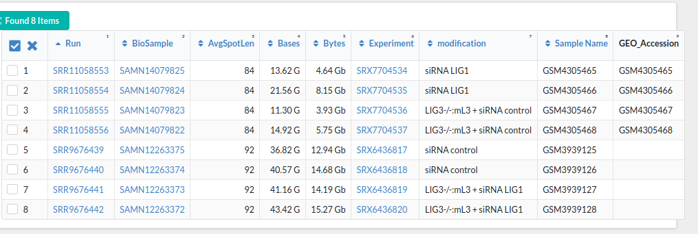

# Some wrangling

Downloaded DRIP browser tracks from 
[UCSC genome browswer](http://genome.ucsc.edu/s/fredericchedinlab/hg19_DRIP_correlation)
Downloaded the HeLa cell stuff since the GLOE seq people also did
their work in some kind of cancer cell line. Those files are all downloaded
through the Snakemake file. 

# Working on snakes

Working on snakemake pipeline made couple choices.

Created R script for "peak calling" so can use bed tools intersect without
intersecting everything. The script will pull out regions whos values are
\>= 3 standard deviations from the mean. 

However looking at GLOE seq files resolution seems to be 1 to 10 kp (???)

Maybe I am looking at the wrong files or might need to actually run the
pipeline.

Originally was thinking I would need to intersect each DRIP file against
each GLOE file one at a time but I think doing an intersection for each
DRIP against *all* GLOE files with `-wa` and `-wb` should work in the same
way. This still does not address the resolution issue or help determine
which samples are which.


# Weirdness in GLOE files

Looks like at least one of the GLOE files has negative values in it. 
Maybe they where normalized?

This seems to be why, using deeptools for something related to replication forks

```
Supplementary_files_format_and_content: BigWig files based on replication fork directionality (RFD) ratio (RFD = (REV – FWD)/(REV + FWD)) were generated using deepTools (version 3.1.0) bigwigCompare program (parameter: -bs 1000 or 10000).
```

**Based on that I do not think we actually want to be using these sup files.**

Looks like there is only one collection of runs that has human samples. Looked
into that more and found you could use this thing called SRA run selector
which gives a nice table of all samples shown below.



I believe we want the controls as this
should have not siRNA silencing stuff
going on.

Add this table to the samples folder plus urls for the two controls (SRA downloads).

This means if not using the pipeline I need to do this stuff
in snakemake

```
Reads were mapped to the human genome (GRCh37/hg19) using bowtie2 (version 2.3.4) and only reads with mapping quality scores greater than 30 were retained using samtools (version 1.5; parameter: -q 30).
BAM files were converted into BED files using BEDTools bamToBed (version 2.25.0) and the location of putative breaks was inferred from the mapped position of sequencing reads, by extracting the nucleotide immediately upstream of the 5’-end of a sequencing read, on the opposite strand.
BED files containing the positions of breaks were converted into BigWig files and were split into plus (FWD) and minus (REV) strands using BEDTools sortBED, genomeCoverageBed (version 2.25.0) and bedGraphToBigWig (version 365).
```

I think it will also be important to consider where all
these files are coming from

```
ESSENTIAL_PROJECT=".../project"   // full path to the project directory
ESSENTIAL_TRIMMOMATIC=".../TruSeq3-SE.fa" // full path to the adapter fasta file
ESSENTIAL_BOWTIE_REF=".../genome" // full path to the reference index files for Bowtie2
ESSENTIAL_BOWTIE_GENOME_INDEX="../saccer3.chrom.sizes" // chromosome sizes file of the reference genome
ESSENTIAL_TXDB="TxDb.Scerevisiae.UCSC.sacCer3.sgdGene" // needed for breaks annotation
ESSENTIAL_ANNODB="org.Sc.sgd.db" // needed for breaks annotation
ESSENTIAL_TSS=200 // TSS region parameter from -200 to +200
ESSENTIAL_FRAGLEN=200 // mean length of library inserts and also minimum peak size called by MACS2
ESSENTIAL_MACS2_GSIZE="1.20E+07" // mappable genome size for MACS2 
ESSENTIAL_THREADS=4 // number of threads for parallel tasks
ESSENTIAL_DUP="all" // relevant for MACS2, it instructs it to keep duplicate reads
ESSENTIAL_BEDCOVERAGE="--smoothLength 1 --binSize 1 --normalizeUsing BPM"
```

Especially the adapter file since I am not sure where that
is.

Maybe these are in the SRA downloads?

Maybe not SRA archives seems just like raw reads off the sequencer. Still
looking for adapter files that are specific to the paper. 

But looking at the SRA folder while dumping the fastq files it is getting
absolutely huge > 133 G for those two control samples.


# HG for mapping reads

Set everything up to download HG from NCBI but then remembered 
there is a ready made bowtie index already available, see (Bowtie manual)[http://bowtie-bio.sourceforge.net/bowtie2/manual.shtml]

Kept the rules to download and concatenate HG files just in case.

# Testing

Created `run.sbatch` to test fastq dump and FastQc stuff since those were
talking a while due to the size of the sra files when blown up to fastq.

Got this running then logged off.


