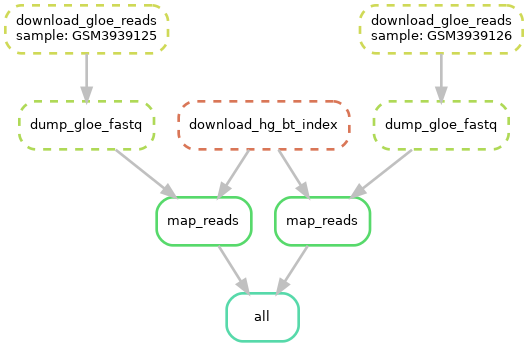
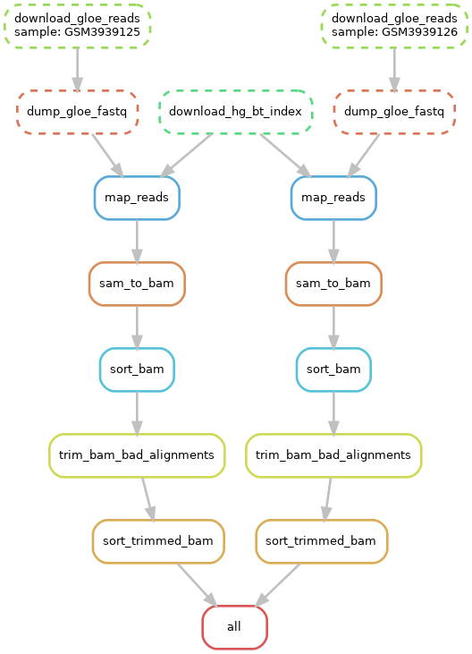

# Focusing on mapping 

Today just thinking about how we might map these reads back to the
reference and see how we could interpret those results

## Bowtie2 indexing issues 

This is basically what is going in in the workflow just trying to map
those 2 control samples back tp human reference for now and seeing
what that looks like.



But having issue with Bowtie index, unzipping to correct location
but Bowtie is not recognizing dir as an index. Tested on local machine
and works fine (?).

Attempted to remake the index using the included `make_hg19.sh` scrip
downloaded with the index files. Lets see how that goes.
If that works would be good to do with snakemake. Would need to move that
script to the scripts folder so could be modified. 

Changed rule in the snakefile to just do the above maybe that will give
better results?

*Fixed indexing issue*

Fixed the issue I think. Was just giving the path to the directory and not
the index name in addition to that which was causing bowtie to look for the
index in the dir above where I thought it was.

I am now wondering if that perl script will be usable on the output
if I do the same thing done in the pipeline bowtie command using samtools.

Below is code block from `bowtie2.module.groovy`

```
    transform(".fastq.gz") to (".bam") {
        exec """
            module load bowtie2/${BOWTIE2_VERSION} &&
            module load samtools/${SAMTOOLS_VERSION} &&
            if [ -n "\$SLURM_JOBID" ]; then
                export TMPDIR=/jobdir/\${SLURM_JOBID};
            fi                                       &&  
            bowtie2 $BOWTIE_FLAGS -x $BOWTIE_REF $input | samtools view $SAMTOOLS_VIEW_FLAG1 - | samtools sort $SAMTOOLS_SORT_FLAGS -T $TMPDIR/\$(basename $output.prefix)_bowtie2_sorted - > ${output.prefix}_bowtie2_sorted.bam &&
            samtools view $SAMTOOLS_VIEW_FLAG2 ${output.prefix}_bowtie2_sorted.bam | samtools sort $BOWTIE_SAMTOOLS_THREADS -T $TMPDIR/\$(basename $output.prefix) -o $output &&
            rm ${output.prefix}_bowtie2_sorted.bam
        ""","bowtie2"
    }
}
```

Added a bunch of rules to do this so now workflow looks like one below



Then hopefully this could be piped into whatever
perl script should be used from the GLOE pipeline.


## Fastq dump errors now?

Got this when redownloading SRA data

```
2021-03-14T18:19:06 fastq-dump.2.8.2 err: libs/kfs/arc.c:2822:KArcDirOpenFileRead: file invalid while opening directory within file system module - failed rawdata/GLOE/GSM3939126.sra
```

Looks like [related to downloading / connection](https://www.biostars.org/p/116142/)
but only using local files??

But the fastq files seem to have been produced? So is this an error? But only
33G in size so maybe not completed. 

This seemed to magically go away


# Thinking about GLOE-pipe

Emailed GLOE-pipe author to see if he could do walk through probably need
to spend some more time trying to get that thing to work.

