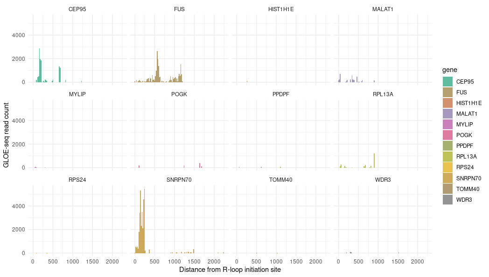

# Visualizing R-loop SSB (nick) distances

## Initial brainstorming

First thing I did was plot the GLOE-seq and footloop intersected data as
histograms. These plots showed the number of GLOE-seq reads at a given
distance from the start of footloop peaks but would only include nicks that
intersect the R-loops which basically gave closest *internal* nick which then
could be viewed by gene.



## Considering upstream nicks

### Concatenation approach

But we are also going to want to consider nicks that are just upstream of the
R-loop initiation sites. This would preclude using bedtools `intersect` function.

So I am thinking could use `closest` function in sort of combination with
intersect. This would first get closest downstream nicks by only allowing
downstream positions, might want to return closest `n` (100? 20?) nicks. Then
combine these results with the intersection results. Would also want to do
a downstream one as well with the same `n` to be fair.

This is assuming the output will have the same format as intersect which I need
to test.

### 1 bp approach

Another strategy could be to only look at the initiation site by cutting the
R-loop to a single base pair then doing closest. This would have benefit of including
upstream and downstream breaks but have the problem of having to set an arbitrary
value for number of nicks to collect which could be a problem because we are
considering read count.

Ideally would collect all nicks within `k` bp of the start position of the
r-loop site but might need to write a script to do that without bedtools.

Never doubt bedtools just found bedtools `window` 

From the [docs](https://bedtools.readthedocs.io/en/latest/content/tools/window.html) 

```
Similar to bedtools intersect, window searches for overlapping features in A and B. However, window adds a specified number (1000, by default) of base pairs upstream and downstream of each feature in A. In effect, this allows features in B that are “near” features in A to be detected.
```

**This is what I am going with**

Using lots of memory, maybe need to use bigmem node? Hopefully not. 
Seems like `window` does not use the efficient sorted algo so have to move to
bigmem2.

bigmem seemed to work, changed cluster config file accordingly.

## Considering strandedness

Thinking more about it I am not sure how important the nick strandedness would
be to R-loop formation kinetics and so I adjusted the snakefile to do intersections
for all-against-all in terms of strands.

## Initial results

Script is working things are looking interesting but need to look more into
the results.


Some genes def have localization at initiation sites but need a better way
to consider if this is greater than chance (random).