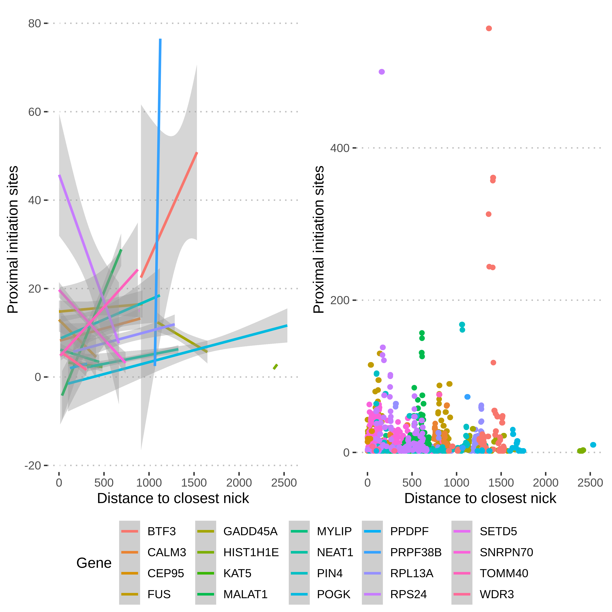

# More thoughts and plots on R-loop nick proximity

This week was a little lax on the notes so following up for a couple of days
here.

Main focus was taking more statistical stance on whether or not R-loops
are closet to nick sites than would be expected at random and then plotting
those results.

## R-loop initiation distances method

Downloaded the footloop amplicon tracks from the genome browser which
describe where R-loops could possibly be found within a gene. This is important
because R-loop initiation sites cannot be measured outside of these regions
and these regions do not cover the whole gene (especially true when looking at
longer genes).

Then wrote R script that will randomly sample these regions to create a
R-loop initiation site "random distribution" that can test against using
a t-test (Normality was confirmed using Shapiro-Wilkes test)

These sites are then mapped against the closest nick treating all nicks as
equal. Stella pointed out (something I was thinking about as well) that
nicks have different number of reads and could do some kind of calling which
I am planning on doing later this weekend but do not expect it to
effect results too much because strong signal of reads is usually flanked by
lower signal which would on average not change distances too much. 

All this and plotting scripts are in the Snakemake file. At some point
should split that up into rule files to make intention of each rule more
clear. 

Produces lots like the one below generally which at the time of
writing are writen to the `plots/footloop_dist_vs_random` dir in the
output dir.

Generally, when looking at the overall distrabution footloop initiation
sites are closer than random but there are plenty of genes where this
is not the case. Additionally when comparing the replicates some genes
the footloop mean distance to closest nick compared to random is
significantly different implying that nicks in each sample are different.

This could be caused by using all nicks as equal which may end up
including a lot of noise so that would be another thing to look for when
doing nick calling.

## Comparing R-loop initiation sites with high concentration with nick distances

One idea Fred and I talked about was why, in some cases, are we seeing
footloop reads with very localized initiation sites, where you might
get 20+ molecules with reads that start within 1-2 bp. What is so
strong about these sites that is causing R-loops to start forming?

One explanation could be co-occurrence of nicks. So used a 6 bp sliding
window approach to score each position in the footloop amplicon based
on the number of nearby initiation sites and look for a correlation
to nick distance.

This was also added to the snakefile and ultimately produces plots like
the one below.

which is not showing any obvious correlation. Fred suggested extending
the window due to the way disulfide sequencing works in relation
with the probability of finding a C on a specific strand.

## Upcoming

This weekend and upcoming week I want to

- Redo above analysis but with break calling and see if results are any different 
- Compare break location of GLOE-seq replicates
- Look into SSB in neuron paper that Fred sent to see if any interesting data that might be there
- Email Rachel to coordinate in lab work

